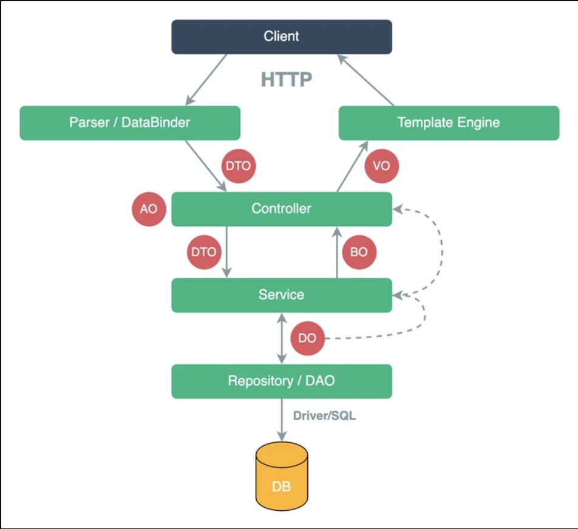

# Quick-Start

## 博客地址

> 1. [Java 面试知识点解析(四)——版本特性篇](https://www.jianshu.com/p/9c50729464b5)
> 2. [Spring源码解析](https://www.yuque.com/huifer/spring/vhvbs3)
> 3. [Java面试+学习指南 - 敖丙](https://github.com/AobingJava/JavaFamily) 
> 3. [CS-Note](https://github.com/CyC2018/CS-Notes)
> 3. **[JCSprout](https://github.com/crossoverJie/JCSprout/tree/master/docs)**

## Article To Read 

> - [ ] [AOP造火箭事件始末](https://github.com/allentofight/easy-cs/blob/main/Java/aop%E9%80%A0%E7%81%AB%E7%AE%AD%E4%BA%8B%E4%BB%B6%E5%A7%8B%E6%9C%AB.md)
> - [ ] [图解HTTP常见问题](https://mp.weixin.qq.com/s/amOya0M00LwpL5kCS96Y6w)
> - [ ] [Spring 常见问题](https://mp.weixin.qq.com/s/wcK2qsZxKDJTLIGqEIyaNg)
> - [ ] [MySQL Explain](https://mp.weixin.qq.com/s/s3IvJ7bm03X49timtQ2e9Q)
> - [ ] [Netty 可以做什么](https://www.zhihu.com/question/24322387)

## 面筋

> 1. https://mp.weixin.qq.com/s/CHPkzE0U9tuyI_NTGFDg5g
> 2. 范围总结：https://mp.weixin.qq.com/s/QGsWVWF2Gv-sj7K4L7FavA

## 项目栗子

> 1. [VUE 可视化商城项目](https://github.com/wangyuan389/mall-cook)
> 1. [Java简单实践项目](https://github.com/521xueweihan/HelloGitHub/blob/master/content/57/HelloGitHub57.md#Java-%E9%A1%B9%E7%9B%AE)

# Java

## 基础

## 并发

## JVM

## 线程

## 其他

### 各种Object

> DO、DTO、BO、AO、VO、POJO 
>
> - DO （ Data Object ）：与数据库表结构一一对应，通过 DAO 层向上传输数据源对象。
> - DTO （ Data Transfer Object ）：数据传输对象，Service 或 Manager 向外传输的对象。
> - BO （ Business Object ）：业务对象。 由 Service 层输出的封装业务逻辑的对象。
> - AO （ Application Object ）：应用对象。 在 Web 层与 Service 层之间抽象的复用对象模型，极为贴近展示层，复用度不高。
> - VO （ View Object ）：显示层对象，通常是 Web 向模板渲染引擎层传输的对象。
> - POJO （ Plain Ordinary Java Object ）：在本手册中，POJO 专指只有 setter/getter/toString 的简单类，包括 DO/DTO/BO/VO 等。
>
> 

# 工具

## Spring

### SpringBoot

### SpringCloud

## Redis

## MyBatis

## Dubbo

## Kafka

## Netty

### 文章

> 1. [Netty知识点](https://juejin.cn/post/6921858121774137352)
> 2. 

# 计算机网络

## HTTP

### 文章

> 1. [XXL开源社区 - HTTP](https://www.xuxueli.com/blog/?blog=./notebook/3-%E7%BD%91%E7%BB%9C/HTTP.md)  

# SQL

## MySQL

## PostgreSQL

# Leetcode

## Solutions Collection

> 1. [LeetCode-Solutions-in-Good-Style](https://github.com/liweiwei1419/LeetCode-Solutions-in-Good-Style)
> 2. [labuladong的算法小抄官方完整版](./refer/labuladong的算法小抄官方完整版.pdf)

# 常见算法

## 排序

## KMP 

### 文章

> 1. [如何更好地理解和掌握KMP算法](https://www.zhihu.com/question/21923021)

## 图论

### 文章

> 1. [图论搜索专题 - 宫水三叶](https://mp.weixin.qq.com/s/RWa897zfd36qhxYunOBAUQ) 

# 书籍

## 在线书籍

> 1. [凤凰架构](http://icyfenix.cn/introduction/about-the-fenix-project.html)
> 2. [Computer Networks](https://book.systemsapproach.org/)

## 在线文章

### zh

### en

> 1. **[Google Test Blogs](https://www.googblogs.com/category/google-testing-blog/)**
> 1. [Huffman-coding](https://www.baseclass.io/newsletter/huffman-coding)
> 2. [XOR-TRICK](https://florian.github.io/xor-trick/)
> 2. [容器知识](https://iximiuz.com/en/posts/container-learning-path/)
> 2. [Postgres Full-Text Search](https://blog.crunchydata.com/blog/postgres-full-text-search-a-search-engine-in-a-database)
> 2. [SQL JOIN explained](https://dataschool.com/how-to-teach-people-sql/sql-join-types-explained-visually/)

## 在线课程

> 1. [The Missing Semester of Your CS Education](https://missing.csail.mit.edu/) 
> 2. [6.824](https://pdos.csail.mit.edu/6.824/schedule.html)
> 3. [ESCAPE data science 2021](https://github.com/escape2020/school2021)

## 好书

## RFC

###  rfc3986

### rfc2616 

### rfc6455

### rfc7539

# 其他

## FFMPEG

> [**FFMPEG.md**](./refer/FFMPEG.md)

## GitHub Actions

> 1. [阮一峰 GitHub Actions 入门](http://www.ruanyifeng.com/blog/2019/09/getting-started-with-github-actions.html)

## 收藏站

> 1. [资源搜索教程](https://www.yuque.com/eureka007/ziyuan/zgh5wk)
> 1. [猿人学 爬虫攻防刷题平台](https://match.yuanrenxue.com/list)
> 1. [Create beautiful images of your code](https://ray.so/)
> 1. [NeteaseCloudMusicApi](https://neteasecloudmusicapi.vercel.app/#/?id=neteasecloudmusicapi)
> 1. [Compare with Programming](https://hyperpolyglot.org/)
> 1. [建站安装命令](https://oneinstack.com/auto/)
> 1. [刷题网站经验之谈](https://justyy.com/archives/31192)
> 1. [GitBook 参考以及 Git操作](https://oreomeow.github.io/Gitbook/)
