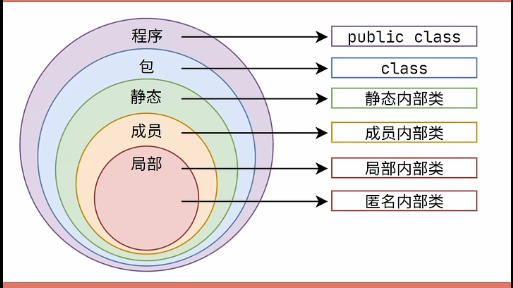

# 基础


## 内部类

> + 成员内部类：作为成员对象的内部类，可以访问private及以上外部类的属性和方法，外部类想要访问内部类属性或方法时，需要创建一个内部类对象，然后通过该对象访问内部类属性或方法。外部类也可以访问private修饰的内部类属性
> + 局部内部类：存在方法中的内部类，访问权限类似局部变量，只能访问外部类的final变量
> + 匿名内部类：只能使用一次，没有类名，只能访问外部类的final变量
> + 静态内部类：类似类的静态成员变量



#### 一、成员内部类，也称作普通内部类

```java
//外部类Outer
public class Outer {
    private int a = 99; //外部类私有属性
    public class Inner {
        int b = 2 ;
        public void test() {
            System.out.println("访问外部类中的a：" + a);
            System.out.println("访问内部类中的b：" + );
        }
    }
    //测试成员内部类
    public static void main (String[] args) {
        Outer o = new  Outer(); //创建外部类对象
        Inner i = o.new Inner(); //使用外部类对象创建内部类对象
        i.test(); //调用内部类对象的test方法
    }
}
```

> 1. 内部类相当于外部类成员变量的位置，可以使用任意访问修饰符，public、private、protected、default
> 2. 内部类的方法可以访问外部类的变量，不受访问控制符限制
> 2. 实例化对象：new Outer().new Inner().test()
> 2. 相同变量名，内部类的可以直接访问，访问外部类的需要使用this关键字

#### 二、静态内部类

```java
public class HelloWorld{
    String name = "xx";
    public static class Inner {
        public void show() {
            System.out.println("访问外部类中的name：" + new HelloWorl().name);
        }
    }
}
```

> 1. 静态内部类不能直接访问外部类的非静态成员，需要实例化外部类再访问
> 2. 创建对象时，不需要使用外部来对象，可以直接创建
> 3. 相同变量名：外部类的需要使用 "类名.静态成员"

#### 三、方法内部类

```java
public class MOuter {
    public void show() {
        final int a = 25;
        int b = 13;
        class MInner {
            int c = 2;
            public void print() {
                System.out.println("访问外部类方法中的常量a：" + a);
                System.out.println("访问内部类的变量c：" + c);
            }
        }
        MInner mi = new MInner();
        mi.print();
    }
    
    public static void main(String[] args ) {
        MOuter mo = new Mouter();
        mo.show();
    } 
}
```

> 方法内部类无法在外部类的方法外的地方使用，因此方法内部类不能使用访问控制符和static 修饰符


## 抽象类 & 接口

### 抽象类


### 接口

#### Java8 接口新增了默认方法


1. 例如：List接口新增了sort方法

```java
public interface List<E> extends Collection<E> {
    //...其他成员
    default void sort(Comparator<? super E> c) {
        //logic code
    }
}
```

2. 需要使用接口实例来调用这些默认方法，default修饰符修饰
3. 与抽象类区别
   1. 一个类只能继承一个抽象类，但一个类可以实现多个接口
   2. 抽象类有实例变量，而接口只能有类变量


## 单例模式
