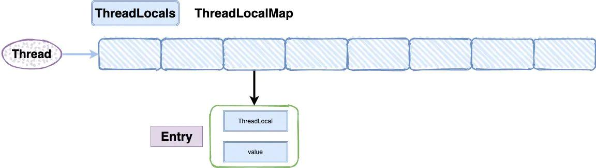

# 并发

## java.util.concurrent

### [信号量 Semaphore](https://zhuanlan.zhihu.com/p/98593407)

##### 一、概念

控制同时访问特定资源的线程数量，通过协调各个线程，以保证合理的使用资源

##### 二、使用场景

资源有明确访问数量限制的场景，常用于限流

> 如数据库连接池、停车场场景。满了需要线程

##### 三、常用方法

> acquire()

## 锁

### Synchronized

```java
public class Test {

    public static void main(String[] args) {
        //Main main = new Main();
        new Thread(()->{
            Main main = new Main();
            main.get();
        }).start();
        new Thread(()->{
            Main main = new Main();
            main.get();
        }).start();
    }

}

class Main{
    private static int i = 0;

    public synchronized void get(){
        i++;
        System.out.println(i);
    }
}
```

> 1. get方法上加锁，锁住的是对象。因为get方法不是static
> 2. 两个线程如果同时使用同一个Main对象，第一个线程会先拿到锁，所以会输出1,2不变
> 3. 两个线程如果使用不同的Main对象，因为是实例锁，两个线程不会互斥。
>    1. 如果i不是static，那么输出都会是1
>    2. i是static，两个线程并发时，都可能会先执行i++，和输出i，所以存在1,2、2,2、**2,1**三种情况
>       1. Main.i是共享可变,两个线程使用lock是不一样的，线程1先执行i++，线程2看到线程1所做的改变，i++和输出2，线程1没看到线程2所做的改变，看到i还是i，输出1
> 4. 原子性和可见性问题


## java.lang

### ThreadLocal

> 线程池对线程的复用会影响后续业务逻辑和造成内存泄漏，会复用ThreadLocal




> 1. 栈内存属于单个线程，每个线程都会有个栈内存，其存储变量只能其所属的线程中可见，也可以理解成线程的私有内存。
> 2. 堆内存的对象可以被所有线程访问
> 3. ThreadLocal实例和值存在堆上，线程可见
> 4. 共享线程的ThreadLocal数据
>    1. 主线程创建InheritableThreadLocal()实例
>    2. 子线程通过这个实例可以获得值
> 5. ThreadLocal问题
>    1. key被设计成弱引用WeakReference。key被gc了，但value还在。
>    2. 内存泄漏
>       1. 线程池的线程复用，之前线程实例处理完之后，出于复用目的线程依然存活，ThreadLocal的value值被持有，导致内存泄漏
>       2. 解决：使用完，调用remove()，值清空
>    3. 为什么key弱引用
>       1. 会造成和entry中value一样的内存泄漏
