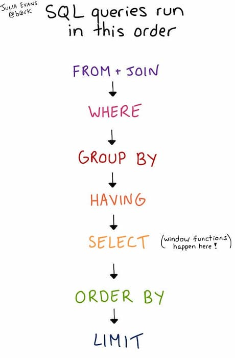

# Explain

## Execute Order


## MySQL explain


## PostgreSQL explain

+ EXPLAIN --show the execution plan of a statement
+ Synopsis
  + explain [(option [, ...])] statement
  + explain [analyze] [verbose] statement
  + where option can be one of:
    + analyze [boolean]
    + verbose [boolean]
    + costs [boolean]
    + buffers [boolean]
    + format {text | xml | json | yaml}
+ 注意
  + analyze该参数会真正执行sql
  + 默认的explain只会进行计划解析，不会执行
  + 执行计划解读
    + 其中cost是成本，第一个数字代表本步骤成本，后一个数字代表总成本
    + 执行计划解读是**自底向上，自右向左**
    + Filter：应用限制条件进行记录过滤
    + Seq Scan：全表扫描
    + Group Key：分组查询的分组键值
    + GroupAggregate：分组聚合结果
    + Nested Loop：嵌套循环处理
    + Materialize：~~物化节点，行高速~~缓存

```sql
EXPLAIN(FORMAT JSON) select * from erp_project
EXPLAIN ( ANALYZE ) SELECT * FROM	erp_project
EXPLAIN select * from erp_project
```
